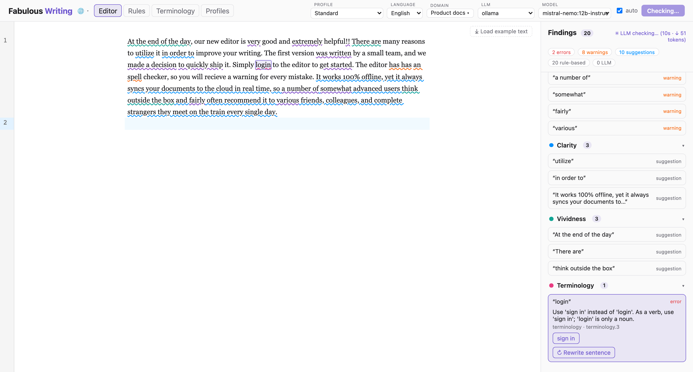
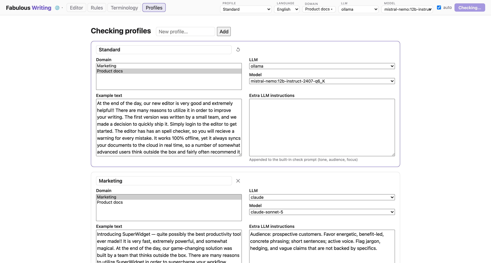
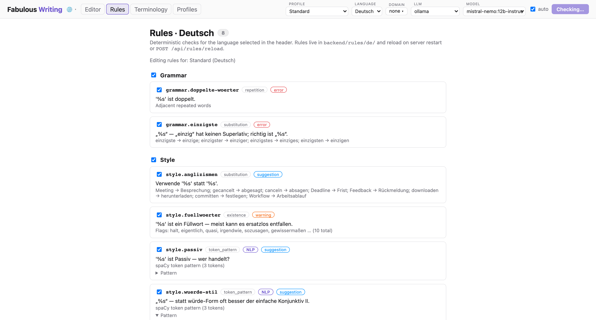
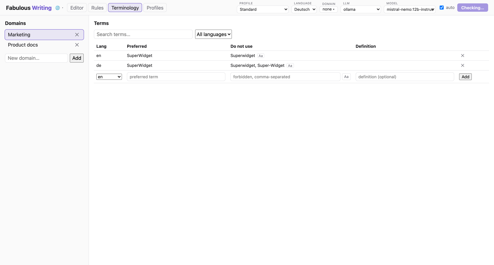

# Fabulous Writing

[](https://github.com/saigyo/fabulous-writing/actions/workflows/backend.yml)
[](https://github.com/saigyo/fabulous-writing/actions/workflows/frontend.yml)

A writing-quality assistant for articles, documentation, and marketing copy. Text in the
editor is continuously checked for spelling, grammar, style, clarity, vividness,
correctness, and domain terminology — by a pluggable LLM and by deterministic local
rules. A sidebar shows findings per category; clicking a finding highlights it in the
text, explains the issue, and offers one-click suggestions.

## What it does

### The editor

Write or paste your text into the editor, pick the text's language, and findings appear
in the sidebar as you type: rule and terminology checks run about a second after you
pause, the LLM check after a longer pause (the **auto** toggle) or on demand via
**Check**. Click a finding to highlight it in the text and see the explanation; apply a
suggested fix with one click. The **⤓ Example** button in the editor's corner loads
the selected checking profile's example text — deliberately flawed material that
matches the profile — the quickest way to see everything in action.



*The editor view: findings grouped by category on the right, the selected finding
highlighted in the text, with explanation and one-click fix.*

### Two checking phases

1. **LLM checking** with pluggable providers — local Ollama models, the Claude API,
   OpenAI, Mistral, or AWS Bedrock. LLM output is never trusted blindly: the model must
   quote each problem verbatim, quotes are re-anchored in your text deterministically,
   and findings that cannot be anchored are discarded. LLM-generated *fixes* pass a
   deterministic gate too — a spell check plus a rule re-check that rejects fixes which
   don't resolve the issue or introduce new ones. If nothing survives, the UI says so
   instead of showing a bad fix.
2. **Deterministic local rules** in a Vale-style YAML formalism — easy to read, easy to
   extend by hand or with an agentic coding tool (see [Writing rules](#writing-rules)).

Rules and terminology checks work entirely offline, without any LLM.

### Checking profiles

A **checking profile** bundles everything that defines *how* a text is checked, per
language: which rules are active, which terminology domains apply, which LLM
provider/model to use, extra LLM instructions (tone, audience, focus — appended to the
built-in check prompt), and a fitting example text. Switch the profile in the header
and the selectors follow; different kinds of writing get different checks — e.g.
technical documentation with vividness rules off and precision-focused LLM guidance,
marketing copy with benefit-led phrasing instructions.

Every language has a non-deletable, editable **Standard** profile; English, German,
and Japanese additionally seed deletable **Marketing** and **Technical Documentation**
examples, so profile switching can be tried out of the box. Header selectors can
always be overridden ad hoc: the profile then shows a ✱ marker with save (persist the
override into the profile) and reset actions. The **Profiles** tab manages everything
else; the **Rules** tab doubles as the selected profile's rule editor.



*The Profiles tab: one profile per row — domains and example text left, the LLM
configuration right.*

### Rule catalog

The **Rules** tab shows the live catalog for the selected language: every loaded rule
with its category, severity, and message, plus any load errors. Its checkboxes edit
the selected checking profile: a category toggle switches a whole group, a per-rule
switch overrides its category (a single rule can stay on inside a disabled category,
or off inside an enabled one) — changes apply to the next check immediately.



*The Rules tab: the live rule catalog, doubling as the selected profile's rule
editor.*

### Terminology

The **Terminology** tab manages domain-specific wording per domain and language: each
term has a preferred form, forbidden variants, and an optional definition. Forbidden
variants found in your text are flagged with the preferred term as a one-click fix.
Marking a term *case-sensitive* (the "Aa" toggle) makes variants match exact-case and
additionally flags wrong casing of the preferred term itself (e.g. "Github" →
"GitHub") — conventional capitalization at sentence starts is allowed. The
table can be sorted by any column (click a header; multiple sort criteria stack),
filtered by language, and searched as you type.



*The Terminology tab: term management with search, language filter, and sortable
columns.*

A fresh installation seeds an example **Product docs** domain with a few style-guide
terms per language (e.g. *sign in* ← "login", *Anwendung* ← "App", *用户* ← "使用者") —
edit or delete it freely.

### Languages

Supported for checking: English, German, French, Spanish, Italian, Japanese, and
Chinese. A language without its optional [spaCy model](#optional-spacy-models-for-linguistic-rules)
still gets regex rules, terminology, and LLM checks ("basic checks only" in the UI).

The UI itself is localized into the same seven languages: it follows the browser locale
by default and can be switched with the 🌐 selector in the header (the choice is
remembered). Rule messages are authored per rule file and are not translated by the UI.

## Setup and running

### Quick start

Backend (requires [uv](https://docs.astral.sh/uv/)):

```sh
cd backend
uv run uvicorn app.main:app --reload --port 8000
```

Frontend (requires Node):

```sh
cd frontend
npm install
npm run dev          # http://localhost:5173
```

That's a fully working installation: rules and terminology checks need nothing else.
The sections below add LLM checking and optional language components.

### LLM providers

Pick a provider in the header; availability is detected automatically. API keys are
read from the environment only and never stored:

| Provider  | Setup |
|-----------|-------|
| `ollama`  | run [Ollama](https://ollama.com) locally — models discovered live |
| `claude`  | `export ANTHROPIC_API_KEY=…` |
| `openai`  | `export OPENAI_API_KEY=…` — chat models discovered live |
| `mistral` | `export MISTRAL_API_KEY=…` — models discovered live |
| `bedrock` | standard AWS credential chain (env/profile/role); model ids are region-specific — discovered live with `bedrock:List*` permissions, or pinned via `bedrock_models` in `config.yaml` |

Which model to pick — per language, API vs. local Ollama, hardware and cost
considerations — is covered in
[docs/model-recommendations.md](docs/model-recommendations.md). It also shows
how to reach further OpenAI-compatible vendors (DeepSeek, Qwen, Gemini,
OpenRouter) through the `openai`/`mistral` slots.

### Configuration

All configuration is optional. Copy `backend/config.example.yaml` to
`backend/config.yaml` and adjust; the example file documents every key. Highlights:

- `providers.*` — default LLM provider, per-provider models/endpoints, Bedrock region
  and pinned model ids
- `seed_terminology: false` — don't seed the example terminology domain
- `seed_example_profiles: false` — don't seed the Marketing / Technical Documentation
  example profiles (the per-language Standard profile is always created)
- `vet_suggestions: false` — disable the deterministic vetting of LLM fixes
- `nlp.models` — spaCy model per language (see below)

### Optional: spaCy models for linguistic rules

Rules that use part-of-speech tags or dependency parses (and precise word matching for
Japanese/Chinese) need the language's [spaCy](https://spacy.io) model:

```sh
cd backend
./scripts/install-models.sh en de        # or: fr es it ja zh
```

Without the model, those rules are skipped (reported in the check response's
`skipped_rules`) while regex rules, terminology, and LLM checks keep working.

**Japanese and GiNZA:** Japanese defaults to [GiNZA](https://github.com/megagonlabs/ginza)'s
`ja_ginza` model — it parses Japanese markedly better than the generic alternative.
Accepted trade-off: GiNZA's releases lag spaCy's and pin the usable spaCy version; if
that ever blocks an upgrade, switch Japanese to the lighter official model in
`config.yaml`:

```yaml
nlp:
  models:
    ja: ja_core_news_sm
```

### Optional: Hunspell dictionaries for better fix vetting

The spell gate that vets LLM-generated fixes uses frequency dictionaries by default.
For morphology-aware spelling (proper inflections, German compounds — far fewer false
rejects, especially for Spanish/Italian), install Hunspell dictionaries:

```sh
cd backend && ./scripts/install-dictionaries.sh en de fr es it
```

Words unknown to the frequency list are then rescued when the language's dictionary
knows them. Dictionaries come from
[wooorm/dictionaries](https://github.com/wooorm/dictionaries) and keep their own
licenses.

## Development

### Repository structure

- `backend/` — Python/FastAPI checking service (rule engine, terminology, LLM
  providers, check API)
- `frontend/` — React single-page app (CodeMirror editor + findings sidebar)
- `docs/superpowers/specs/` — design documents
- `docs/LOGBOOK.md` — development log: session summaries with commit pointers

Both dev servers (see [Quick start](#quick-start)) hot-reload: `uvicorn --reload` for
the backend, Vite for the frontend.

### Tests and CI

```sh
cd backend && uv run pytest
cd frontend && npm test && npm run lint && npm run build
```

GitHub Actions runs the same checks on every push to `main` and every PR
(`.github/workflows/backend.yml`, `frontend.yml`); Dependabot keeps Python, Node, and
action dependencies current. `backend/scripts/vetting-benchmark.py` reports
false-reject rates of the suggestion-vetting spell gate.

To refresh the README screenshots after UI changes (with both dev servers running):
`cd frontend && npm run screenshots` (needs
`npx playwright install --only-shell chromium` once).

### Writing rules

Rules live in `backend/rules/<language>/<group>/<name>.yml` and are picked up on
startup or via `POST /api/rules/reload`. A catalog of all shipped rules — with
what each one demonstrates — is in [backend/rules/README.md](backend/rules/README.md);
the app's *Rules* tab shows the live catalog for the selected language (from
`GET /api/rules?language=…`).
Four check types:

```yaml
# existence: flag words/phrases (tokens get word boundaries; raw is verbatim regex)
extends: existence
message: "'%s' is a weasel word — be specific."
level: warning            # error | warning | suggestion
category: style           # spelling|grammar|style|clarity|vividness|correctness
ignorecase: true
tokens: [very, extremely]
raw: ['!{2,}']

# substitution: flag and suggest a replacement
extends: substitution
message: "Use '%s' instead of '%s'."
swap:
  utilize: use

# occurrence: limit matches of a pattern per sentence
extends: occurrence
message: "Sentence longer than 30 words — consider splitting it."
scope: sentence
token: '\b\w+\b'
max: 30
# For languages without whitespace word boundaries (ja/zh), count spaCy
# tokens instead of regex matches (requires the language's spaCy model):
#   count: tokens

# repetition: flag adjacent duplicated words ("the the")
extends: repetition
message: "'%s' is repeated."
```

Invalid rule files are reported by `GET /api/rules` (and at startup) but never break
the engine.

#### Advanced linguistic rules (spaCy)

Two further rule types use [spaCy](https://spacy.io) for tokenization, POS tags, and
dependency parses. They embed spaCy's native pattern syntax directly and need the
language's model installed (see
[Optional: spaCy models](#optional-spacy-models-for-linguistic-rules)):

```yaml
# token_pattern: match token sequences (spaCy Matcher syntax)
# https://spacy.io/usage/rule-based-matching#matcher
extends: token_pattern
message: "'%s' hides the action in a noun — use the verb directly."
category: style
pattern:
  - {LEMMA: make}
  - {POS: DET, OP: "?"}
  - {LOWER: {IN: [decision, assessment]}}

# dependency: match syntax trees (spaCy DependencyMatcher syntax)
# https://spacy.io/usage/rule-based-matching#dependencymatcher
extends: dependency
message: "'%s' is passive voice — consider naming who does the action."
category: style
pattern:
  - {RIGHT_ID: verb, RIGHT_ATTRS: {TAG: VBN}}
  - {LEFT_ID: verb, REL_OP: ">", RIGHT_ID: aux, RIGHT_ATTRS: {DEP: auxpass}}
```

Patterns support the full Matcher vocabulary — `LEMMA`, `POS`, `TAG`, `DEP`,
`MORPH`, `REGEX`, `IN`/`NOT_IN` sets, and `OP` quantifiers. The rule files under
`backend/rules/` double as a cookbook: see e.g. `en/grammar/article-an.yml`
(REGEX), `de/style/wuerde-stil.yml` (MORPH + OP gap), `fr/style/voix-passive.yml`
(dependency via `aux:pass`), and `zh/style/jinxing.yml` (optional tokens).
Patterns are validated when rules load; errors appear in `GET /api/rules`.

One GiNZA-specific note: GiNZA 5.2's pipeline config is rejected by newer confection
versions; the backend transparently retries loading with an explicit `split_mode`.

### Terminology internals

Terminology CRUD lives under `/api/domains` and `/api/terms`; the seeded example
domain is only created when no domains exist (`seed_terminology: false` disables it).

For Japanese and Chinese, forbidden variants are matched over spaCy tokens
(PhraseMatcher) — `\b` word boundaries don't exist in CJK scripts. Without the
language's model, matching falls back to plain substring search, which may over-match
inside longer words.

### API

Interactive OpenAPI docs at `http://localhost:8000/docs`. The essentials:

```sh
# Run a check (rules inline; LLM findings stream via SSE)
curl -X POST localhost:8000/api/checks -H 'Content-Type: application/json' \
  -d '{"text": "This is is very good.", "language": "en", "checkers": ["rules", "llm"]}'
curl -N localhost:8000/api/checks/<check_id>/events   # SSE stream
curl localhost:8000/api/checks/<check_id>             # polling fallback

# LLM fix for one finding: scope "span" = drop-in replacement, "sentence" = whole-sentence rewrite
curl -X POST localhost:8000/api/suggestions -H 'Content-Type: application/json' \
  -d '{"text": "It is very good.", "span": {"start": 6, "end": 10}, "message": "Weasel word.", "language": "en", "scope": "sentence"}'

curl localhost:8000/api/languages                     # languages + NLP model availability
curl localhost:8000/api/profiles?language=en          # checking profiles (incl. example texts)
curl localhost:8000/api/providers                     # LLM provider availability
curl localhost:8000/api/rules?language=de             # rule catalog (+ load errors); language optional
curl localhost:8000/api/domains                       # terminology CRUD under /api/domains, /api/terms
```

### Contributing

Design documents for larger features live in `docs/superpowers/specs/`; development
sessions are summarized in `docs/LOGBOOK.md` with commit pointers. New behavior comes
with tests (backend `pytest`, frontend `vitest`), and CI must be green.

## License

[MIT](LICENSE)
