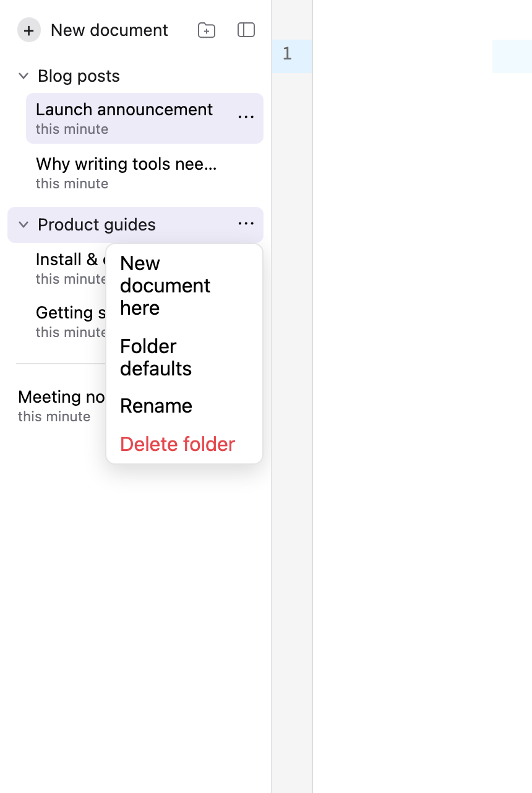
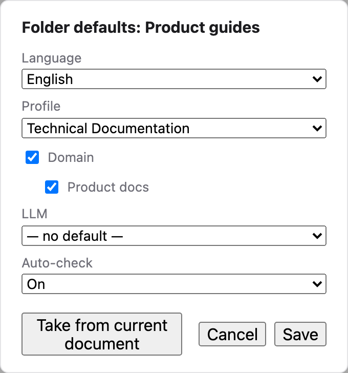
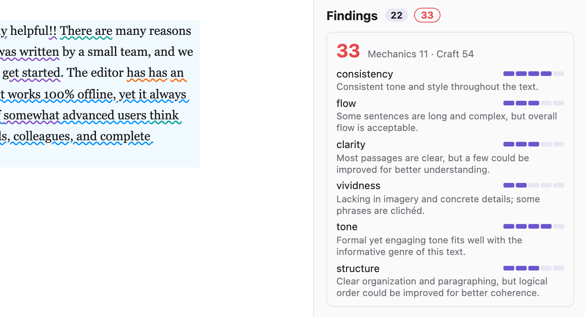

# Fabulous Writing

[](https://github.com/saigyo/fabulous-writing/actions/workflows/backend.yml)
[](https://github.com/saigyo/fabulous-writing/actions/workflows/backend.yml)
[](https://github.com/saigyo/fabulous-writing/actions/workflows/frontend.yml)
[](https://github.com/saigyo/fabulous-writing/actions/workflows/frontend.yml)

A writing-quality assistant for articles, documentation, and marketing copy. Text in the
editor is continuously checked for spelling, grammar, style, clarity, vividness,
correctness, and domain terminology — by a pluggable LLM and by deterministic local
rules. A sidebar shows findings per category; clicking a finding highlights it in the
text, explains the issue, and offers one-click suggestions.

## What it does

### The editor

Write or paste your text into the editor, pick the text's language, and findings appear
in the sidebar as you type: rule and terminology checks run about a second after you
pause, the LLM check after a longer pause (the **auto** toggle) or on demand via
**Check**. Click a finding to highlight it in the text and see the explanation; apply a
suggested fix with one click. While a document is still empty, the **⤓ Example**
button in the editor's corner loads the selected checking profile's example text —
deliberately flawed material that matches the profile — the quickest way to see
everything in action.


*The editor view: documents and folders on the left, findings grouped by category on
the right, the selected finding highlighted in the text with explanation and
one-click fix.*

### Documents and project folders

Your writing lives in **documents** — stored server-side and autosaved as you type
(about 1.5 s after you pause). The collapsible sidebar left of the editor lists them
most-recently-edited first; only real edits and renames reorder the list — opening a
document or its automatic checks never do. A new document names itself after the
first ~20 words (generated once by the economical LLM tier, first words as fallback);
rename or delete it via its ⋯ menu, hover it for the exact edited-at time. Each
document remembers its own checking setup — language, profile, terminology domains,
LLM choice, and the auto toggle travel with the document, so switching documents
switches the whole header.

Edits are buffered locally and replayed if the backend is momentarily unreachable;
should the replay conflict with what the server has meanwhile, the local version is
preserved as a *«name» (recovered)* copy instead of silently losing either side.

Documents can be grouped into **project folders** (the ⊞ icon in the sidebar
header): collapsible groups above the ungrouped list, menu-based moving ("Move to
folder"), and "New document here" in each folder's ⋯ menu. Deleting a folder never
deletes documents — members simply return to the ungrouped list.



*The document sidebar: project folders with their documents, the ungrouped list
below, and a folder's ⋯ menu.*

A folder can carry **defaults** — language, checking profile, terminology domains,
LLM choice, and the auto toggle, each individually optional — applied to documents
created inside it. Unset fields fall back to whatever the header shows at creation
time, and **Take from current document** snapshots your current setup into the
folder in one click. Moving an existing document into a folder never changes its
settings.



*Folder defaults: per-folder settings for new documents, in the spirit of project
instructions.*

### Two checking phases

1. **LLM checking** with pluggable providers — local Ollama models, the Claude API,
   OpenAI, Mistral, or AWS Bedrock. LLM output is never trusted blindly: the model must
   quote each problem verbatim, quotes are re-anchored in your text deterministically,
   and findings that cannot be anchored are discarded. LLM-generated *fixes* pass a
   deterministic gate too — a spell check plus a rule re-check that rejects fixes which
   don't resolve the issue or introduce new ones. If nothing survives, the UI says so
   instead of showing a bad fix.
2. **Deterministic local rules** in a Vale-style YAML formalism — easy to read, easy to
   extend by hand or with an agentic coding tool (see [Writing rules](#writing-rules)).

Rules and terminology checks work entirely offline, without any LLM.

- Overall quality score: live 0–100 gauge combining a deterministic mechanics score
  with a six-dimension LLM craft scorecard — see [`docs/scoring.md`](docs/scoring.md).



*The quality score expanded: deterministic mechanics plus the six LLM-scored craft
dimensions, each with a one-line note.*

### Checking profiles

A **checking profile** bundles everything that defines *how* a text is checked, per
language: which rules are active, which **rule packs** are enabled, which terminology
domains apply, which quality tier — or pinned LLM provider/model — to use, extra LLM
instructions (tone, audience, focus — appended to the built-in check prompt), and a
fitting example text. Switch the profile in the header and the selectors follow;
different kinds of writing get different checks — e.g. technical documentation with
vividness rules off and precision-focused LLM guidance, marketing copy with
benefit-led phrasing instructions.

**Rule packs** are use-case rule sets that stay off unless a profile turns them on —
today's catalog ships `marketing`, `techdocs`, and `blog` packs for English and German,
each toggled per profile from a chip on its Profiles-tab card or a section in the
Rules tab. The set is extensible without touching code: dropping a new rule YAML file
with a fresh `pack:` slug makes that pack available everywhere a pack picker appears.

Every shipped rule is also **self-documenting**: it carries `bad`/`good` example
sentences that render right on its card in the Rules tab, and the same sentences run
as an automated test against the rule, so the catalog can't drift out of sync with
its own documentation.

Every language has a non-deletable, editable **Standard** profile; English, German,
and Japanese additionally seed deletable **Marketing** and **Technical Documentation**
examples (with their packs pre-enabled), and English and German further seed a
**Blog** example (with the `blog` pack enabled) — so profile switching, including rule
packs, can be tried out of the box. Header selectors can always be overridden ad hoc:
the profile then shows a ✱ marker with save (persist the override into the profile)
and reset actions. The **Profiles** tab manages everything else; the **Rules** tab
doubles as the selected profile's rule editor.


*The Profiles tab: one profile per row — domains and example text left, the LLM
tier (or pinned model) and instructions right.*

### Rule catalog

The **Rules** tab shows the live catalog for the selected language: every loaded rule
with its category, severity, message, and its `bad`/`good` example sentences, plus any
load errors. Its checkboxes edit the selected checking profile: a category toggle
switches a whole group, a per-rule switch overrides its category (a single rule can
stay on inside a disabled category, or off inside an enabled one) — changes apply to
the next check immediately. General rules are grouped by category as before; any
use-case **rule packs** (marketing, techdocs, blog, …) get their own section below,
each with a pack-level toggle plus the same per-rule overrides.


*The Rules tab: the live rule catalog, doubling as the selected profile's rule
editor.*

### Terminology

The **Terminology** tab manages domain-specific wording per domain and language: each
term has a preferred form, forbidden variants, and an optional definition. Forbidden
variants found in your text are flagged with the preferred term as a one-click fix.
Marking a term *case-sensitive* (the "Aa" toggle) makes variants match exact-case and
additionally flags wrong casing of the preferred term itself (e.g. "Github" →
"GitHub") — conventional capitalization at sentence starts is allowed. The
table can be sorted by any column (click a header; multiple sort criteria stack),
filtered by language, and searched as you type.


*The Terminology tab: term management with search, language filter, and sortable
columns.*

A fresh installation seeds an example **Product docs** domain with a few style-guide
terms per language (e.g. *sign in* ← "login", *Anwendung* ← "App", *用户* ← "使用者") —
edit or delete it freely.

### Languages

Supported for checking: English, German, French, Spanish, Italian, Japanese, and
Chinese. A language without its optional [spaCy model](#optional-spacy-models-for-linguistic-rules)
still gets regex rules, terminology, and LLM checks ("basic checks only" in the UI).

The UI itself is localized into the same seven languages: it follows the browser locale
by default and can be switched with the 🌐 selector in the header (the choice is
remembered). Rule messages are authored per rule file and are not translated by the UI.

## Run it in a container (quickstart)

Requires only Docker.

```sh
curl -fsSLO https://raw.githubusercontent.com/saigyo/fabulous-writing/main/fabulous.sh && chmod +x fabulous.sh
./fabulous.sh setup    # interactive: admin account, one LLM provider
./fabulous.sh serve    # http://localhost:8080
```

Or with plain `docker run`:

```sh
docker run --rm -it -v fabulous-config:/config ghcr.io/saigyo/fabulous-writing:latest setup
docker run --rm -v fabulous-config:/config -v fabulous-data:/data -p 8080:8000 \
  ghcr.io/saigyo/fabulous-writing:latest serve
```

- The wizard writes all configuration to the `fabulous-config` volume and
  can be re-run at any time (e.g. to switch LLM providers); it pre-fills
  your previous answers.
- Your data lives in the `fabulous-data` volume; backup = copy that
  volume's directory.
- Versions: images are tagged `X.Y.Z` (git tag `vX.Y.Z`) plus `latest`;
  `./fabulous.sh serve 0.1.0` pins a version. Releases are cut
  deliberately by pushing an annotated tag `vX.Y.Z` — the release
  workflow builds and publishes the image, then creates the GitHub
  Release; nothing is released automatically on pushes to `main`.

### Updating

`./fabulous.sh serve` checks for a newer image on every start (`docker
pull` — a no-op when you're current, skipped with a warning when
offline) and prints the version it serves. A pinned version (e.g.
`./fabulous.sh serve 0.1.0`) just validates/pulls that tag and stays
put — it never moves to a newer one on its own. With plain `docker
run`, update manually:

```sh
docker pull ghcr.io/saigyo/fabulous-writing:latest
```

Image updates never touch your configuration or data — both live in
the `fabulous-config`/`fabulous-data` volumes. To check the version of
the image you have locally:

```sh
docker inspect --format '{{index .Config.Labels "org.opencontainers.image.version"}}' \
  ghcr.io/saigyo/fabulous-writing:latest
```

The running app also reports its version at `/api/health`.

### Troubleshooting

- **Ollama not reachable from the container** — the app runs inside
  Docker, so `localhost:11434` is the container, not your machine.
  This applies to both Ollama-only and commercial-provider setups (the
  local tier probes `providers.ollama_base_url` for availability in both).
  On macOS/Windows use `http://host.docker.internal:11434` (the wizard's
  default). On Linux add `--add-host=host.docker.internal:host-gateway`
  to BOTH the `setup` and `serve` `docker run` lines — the wizard's
  model-list fetch also runs inside the `setup` container (edit both
  lines in `fabulous.sh` or use plain `docker run`), or use your
  `docker0` gateway IP (usually `http://172.17.0.1:11434`). On macOS/Windows
  (Docker Desktop, colima/lima), Ollama's default `127.0.0.1` bind is reachable
  via the host-side proxy — no `OLLAMA_HOST` change needed, and none should be
  made (it's the safest setup). On native Linux Docker, the bridge IP cannot
  reach a loopback-only bind — bind Ollama to the docker bridge specifically
  (e.g. `OLLAMA_HOST=172.17.0.1`) or firewall port 11434. Since Ollama's API
  has no authentication, a wildcard bind (0.0.0.0) exposes it to the whole local
  network and should be avoided. On commercial-provider configs, the
  Ollama URL has no setup prompt; to correct a stale hand-edited value
  in `config.yaml`, edit it directly (or switch to the Ollama provider,
  which re-prompts the URL).
- **Port already in use** — pick another host port: `FW_PORT=9090
  ./fabulous.sh serve` (or change `-p 9090:8000`).
- **Behind a reverse proxy (nginx/Traefik/…)** — set `FW_TRUSTED_PROXIES`
  on the serve container (e.g. `docker run -e FW_TRUSTED_PROXIES=172.16.0.1
  …`) to the proxy's address as the container sees it (comma-separated,
  CIDRs and `*` allowed — uvicorn's `--forwarded-allow-ips` syntax).
  Without it, every visitor arrives with the proxy's IP and the login
  throttle treats all clients as one. The direct `-p` mapping of the
  quickstart needs none of this; leave it unset there. `*` trusts every
  peer, so any client can spoof `X-Forwarded-For` and bypass the login
  throttle — use it only where the container is unreachable except
  through the proxy; prefer the proxy's actual address or CIDR.

Third-party license notices for everything bundled in the image are in
[THIRD-PARTY-NOTICES.md](THIRD-PARTY-NOTICES.md) (also at
`/app/THIRD-PARTY-NOTICES.md` inside the image).

### Hosted deployment (fly.io)

For a hosted demo instance rather than a self-managed container, this repo
also ships a fly.io deployment target: the same released image, reused
as-is, with its machine definition and non-secret config committed under
[`deploy/fly/`](deploy/fly/) and secrets set via `fly secrets`. See
[docs/fly-deployment.md](docs/fly-deployment.md) for the operator runbook.

## Setup and running

### Quick start

Backend (requires [uv](https://docs.astral.sh/uv/)); in the default configuration, startup
fails closed without the three `FW_*` variables below (see
[Authentication](#authentication) for what they do):

```sh
cd backend
export FW_AUTH_SECRET="$(openssl rand -base64 32)"
export FW_ADMIN_EMAIL="you@example.com"
export FW_ADMIN_PASSWORD="a bootstrap password"
uv run uvicorn app.main:app --reload --port 8000
```

Frontend (requires Node):

```sh
cd frontend
npm install
npm run dev          # http://localhost:5173
```

**The app requires signing in.** Every screen sits behind a login gate; on
first load, sign in with the `FW_ADMIN_EMAIL`/`FW_ADMIN_PASSWORD` you just
set above — that bootstrap admin is the only account that exists until you
create more (see [Authentication](#authentication)).

With the three variables set, that's a fully working installation: rules and
terminology checks need nothing else. The sections below add LLM checking and
optional language components.

### LLM providers

Pick a provider in the header; availability is detected automatically. API keys are
read from the environment only and never stored:

| Provider  | Setup |
|-----------|-------|
| `ollama`  | run [Ollama](https://ollama.com) locally — models discovered live |
| `claude`  | `export ANTHROPIC_API_KEY=…` — models discovered live |
| `openai`  | `export OPENAI_API_KEY=…` — chat models discovered live |
| `mistral` | `export MISTRAL_API_KEY=…` — models discovered live |
| `bedrock` | standard AWS credential chain (env/profile/role); model ids are region-specific — discovered live with `bedrock:List*` permissions, or pinned via `bedrock_models` in `config.yaml` |
| config-defined extras | any OpenAI-compatible vendor (DeepSeek, Qwen, Gemini, OpenRouter, …) via `providers.extra_providers` in `config.yaml`; key from `<NAME>_API_KEY` |

In the header you normally pick a **quality tier** (Best quality / Balanced /
Fast & economical / Private (local) — config ids `quality` / `balanced` /
`cheap` / `local`) — a per-language routing table (`routing` in `config.yaml`,
sensible defaults built in) resolves it to a concrete provider and model, and
unavailable tiers are shown greyed out with the reason. The Advanced panel
still lets you pin an exact provider+model; checking profiles store either a
tier or a pin.

Which model to pick — per language, API vs. local Ollama, hardware and cost
considerations — is covered in
[docs/model-recommendations.md](docs/model-recommendations.md).

### Authentication

The backend has user accounts, local email/password login, and — as of this
milestone — **every `/api` endpoint requires a logged-in user** except `GET
/api/health` and `POST /api/auth/login`. The API documentation endpoints
(`/docs`, `/redoc`, `/openapi.json`) are served only in the `dev` environment
(see [Configuration](#configuration) below) — staging and production don't
register them at all (see
[Authentication and user accounts](docs/backend-architecture.md#authentication-and-user-accounts)
in the architecture doc). In the default configuration, startup also fails
closed without the three variables below — that's why they're already set in
[Quick start](#quick-start) above. Sign in with them on first load: there is
no other account until you create one (via the admin API/CLI; there is no
self-service signup). **Data is not yet scoped per owner** — every account
currently sees the same documents, folders, profiles, and terminology; a
future milestone adds per-user ownership. These variables are read from the
environment only, never stored:

| Variable | Purpose |
|-----------|-------|
| `FW_AUTH_SECRET` | HS256 token-signing secret, **required** to start the backend in `auth.mode: local` (the default), at least 32 characters. Generate one with `openssl rand -base64 32`. Startup fails closed without it, unless `auth.ephemeral_secret: true` is set in `config.yaml` for local development (a random secret is generated per process start, so every token dies on restart — never use this outside development). |
| `FW_ADMIN_EMAIL` | Email for the bootstrap admin account. Read **only while the `users` table is empty** — once any user exists, this variable is ignored, so it can never serve as a standing password reset. |
| `FW_ADMIN_PASSWORD` | Password for the bootstrap admin account, at least 12 characters. Same "only while empty" rule as `FW_ADMIN_EMAIL`. |

`backend/config.example.yaml`'s `auth:` block documents the same variables
alongside the related config-only knobs (`mode`, `ephemeral_secret`,
`allow_additional_admins`). Password/account recovery without a working web
session is available via the operator CLI: `uv run python -m app.manage
--help` (from `backend/`).

### Hosted authentication (Supabase)

Setting `auth.mode: supabase` in `config.yaml` replaces the backend's own
password storage and token signing with a [supabase.com](https://supabase.com)
project: Supabase owns credentials, password resets, and admin-invite email;
this backend still owns authorization (tier, admin flag, active/deactivated)
and independently rejects anonymous Supabase tokens on their claims, not just
via dashboard configuration. Email confirmation is enforced structurally
instead: admin-created and invited accounts are created with `email_confirm`
set, and the reset/invite flows themselves prove control of the mailbox
before a session is issued — public signup stays off, so there is no path to
an account the backend would need to distrust on that basis. `FW_AUTH_SECRET`
is not needed in this mode. See
[docs/supabase-auth-setup.md](docs/supabase-auth-setup.md) for the full
dashboard walkthrough — project creation, the JWT key rotation this mode
requires, and the environment variables that replace `FW_AUTH_SECRET`.

### Configuration

All configuration is optional. Copy `backend/config.example.yaml` to
`backend/config.yaml` and adjust; the example file documents every key. Highlights:

- `providers.*` — default LLM provider, per-provider models/endpoints, extra
  OpenAI-compatible providers (`extra_providers`), Bedrock region and pinned model ids
- `seed_terminology: false` — don't seed the example terminology domain
- `seed_example_profiles: false` — don't seed the Marketing / Technical Documentation
  example profiles (the per-language Standard profile is always created)
- `vet_suggestions: false` — disable the deterministic vetting of LLM fixes
- `nlp.models` — spaCy model per language (see below)

### Optional: spaCy models for linguistic rules

Rules that use part-of-speech tags or dependency parses (and precise word matching for
Japanese/Chinese) need the language's [spaCy](https://spacy.io) model:

```sh
cd backend
./scripts/install-models.sh en de        # or: fr es it ja zh
```

Without the model, those rules are skipped (reported in the check response's
`skipped_rules`) while regex rules, terminology, and LLM checks keep working.

**Japanese and GiNZA:** Japanese defaults to [GiNZA](https://github.com/megagonlabs/ginza)'s
`ja_ginza` model — it parses Japanese markedly better than the generic alternative.
Accepted trade-off: GiNZA's releases lag spaCy's and pin the usable spaCy version; if
that ever blocks an upgrade, switch Japanese to the lighter official model in
`config.yaml`:

```yaml
nlp:
  models:
    ja: ja_core_news_sm
```

### Optional: Hunspell dictionaries for better fix vetting

The spell gate that vets LLM-generated fixes uses frequency dictionaries by default.
For morphology-aware spelling (proper inflections, German compounds — far fewer false
rejects, especially for Spanish/Italian), install Hunspell dictionaries:

```sh
cd backend && ./scripts/install-dictionaries.sh en de fr es it
```

Words unknown to the frequency list are then rescued when the language's dictionary
knows them. Dictionaries come from
[wooorm/dictionaries](https://github.com/wooorm/dictionaries) and keep their own
licenses.

## Development

### Repository structure

- `backend/` — Python/FastAPI checking service (rule engine, terminology, LLM
  providers, check API)
- `frontend/` — React single-page app (CodeMirror editor + findings sidebar)
- `docs/superpowers/specs/` — design documents
- `docs/LOGBOOK.md` — development log: session summaries with commit pointers

Both dev servers (see [Quick start](#quick-start)) hot-reload: `uvicorn --reload` for
the backend, Vite for the frontend.

Building the container image locally (`docker build .`) requires Docker with the
buildx plugin (BuildKit — needed for `COPY --chmod`); on a Homebrew-installed Docker
CLI, wire `docker-buildx` into `~/.docker/cli-plugins` if `docker build` fails to find it.

### Architecture

The two halves meet at one shared contract — the **Finding**: a categorized issue with
an exact character span and drop-in suggestions. The backend produces findings through
a job-based check API (fast deterministic checkers inline, LLM findings streamed via
SSE and gated by deterministic anchoring/vetting); the frontend keeps them positioned
correctly while the user types by tracking spans inside the CodeMirror document.
Detailed developer documentation:

- **[Backend architecture](docs/backend-architecture.md)** — application assembly,
  the check flow and job/SSE model, the YAML rule engine, the NLP registry,
  terminology matching, the LLM provider layer with its deterministic gates,
  checking profiles, and testing conventions.
- **[Frontend architecture](docs/frontend-architecture.md)** — state management,
  the CodeMirror `StateField` that owns finding positions, the checking lifecycle
  (debounce, staleness/supersede guards), finding identity across checks, profile
  semantics, i18n, and testing.
- **[Browser extension](docs/browser-extension.md)** — the Chromium extension
  host client (`clients/browser-extension/`): architecture, unpacked install,
  development, e2e, and the GitHub manual acceptance checklist.

### Tests and CI

```sh
cd backend && uv run pytest
cd frontend && npm test && npm run lint && npm run build
```

GitHub Actions runs the same checks on every push to `main` and every PR
(`.github/workflows/backend.yml`, `frontend.yml`); Dependabot keeps Python, Node, and
action dependencies current. `backend/scripts/vetting-benchmark.py` reports
false-reject rates of the suggestion-vetting spell gate.

There is also an offline e2e suite that boots the real backend against a local
Supabase stack to exercise login, refresh rotation, logout, password change,
invite acceptance, and password reset end to end:

```sh
scripts/e2e-supabase.sh        # run the suite (starts the stack if it's down)
scripts/e2e-supabase.sh --down # stop the local supabase stack
```

A running stack keeps its boot-time config, so edits to `supabase/config.toml`
or `supabase/templates/` need `scripts/e2e-supabase.sh --down` first before
they take effect.

It needs Docker (via [colima](https://github.com/abiosoft/colima)) and the
[supabase CLI](https://supabase.com/docs/guides/cli) **≥ 2.114.0** locally
(the stack's ES256 signing-key handling was verified against that version;
older CLIs fail on it with opaque errors); the default `pytest` gate above
never needs either.

To refresh the README screenshots after UI changes (with both dev servers running):
`cd frontend && npm run screenshots` (needs
`npx playwright install --only-shell chromium` once). The script stages its own
scratch documents and folders through the API and removes them afterwards; it never
opens or modifies existing documents.

### Releases

Releases are cut deliberately — nothing is published on pushes to `main`.
The git tag is the single source of truth for the app version
(`pyproject.toml`/`package.json` versions are not bumped):

```sh
git tag -a v0.2.0 -m "v0.2.0" && git push origin v0.2.0
```

The tag (semver `vX.Y.Z`; anything else is refused) triggers
`.github/workflows/release.yml`, which builds the container image for
amd64 and arm64, pushes it to `ghcr.io/saigyo/fabulous-writing` tagged
`X.Y.Z` and `latest`, and — only after a successful push — creates the
GitHub Release with generated notes, so a Release page never exists
without its image. The running app reports its version in
`/api/health`. Every PR that touches an image input gets a build check
and the license drift gate via `.github/workflows/docker.yml`.

### Writing rules

Rules live in `backend/rules/<language>/<group>/<name>.yml` and are picked up on
startup or via `POST /api/rules/reload`. A catalog of all shipped rules — with
what each one demonstrates — is in [backend/rules/README.md](backend/rules/README.md);
the app's *Rules* tab shows the live catalog for the selected language (from
`GET /api/rules?language=…`), including each rule's flagged/clean example sentences.

Every rule file **must** carry an `examples:` block — `bad` sentences the rule has to
flag, `good` sentences it must not. This is enforced at load time (a missing block
fails validation) and exercised by a catalog-wide test
(`backend/tests/test_rule_examples.py`) that runs every rule against its own
examples, so the catalog documents and tests itself in one place. A rule can also
carry an optional `pack: <slug>` (e.g. `pack: marketing`) to mark it as a
use-case rule: off unless a checking profile has that pack enabled (see
[Checking profiles](#checking-profiles)); pack slugs need no registration — they are
discovered from whichever rule files declare them.
Four basic check types:

```yaml
# existence: flag words/phrases (tokens get word boundaries; raw is verbatim regex)
extends: existence
message: "'%s' is a weasel word — be specific."
level: warning            # error | warning | suggestion
category: style           # spelling|grammar|style|clarity|vividness|correctness
ignorecase: true
tokens: [very, extremely]
raw: ['!{2,}']
examples:
  bad: ["This is very interesting."]
  good: ["This is a precise result."]

# substitution: flag and suggest a replacement
extends: substitution
message: "Use '%s' instead of '%s'."
swap:
  utilize: use
examples:
  bad: ["We utilize this tool."]
  good: ["We use this tool."]

# occurrence: limit matches of a pattern per sentence
extends: occurrence
message: "Sentence longer than 30 words — consider splitting it."
scope: sentence
token: '\b\w+\b'
max: 30
# For languages without whitespace word boundaries (ja/zh), count spaCy
# tokens instead of regex matches (requires the language's spaCy model):
#   count: tokens
examples:
  bad: ["A sentence that keeps going and going and going ... (30+ words)."]
  good: ["A short sentence."]

# repetition: flag adjacent duplicated words ("the the")
extends: repetition
message: "'%s' is repeated."
examples:
  bad: ["It is is fine."]
  good: ["It is fine."]
```

Invalid rule files are reported by `GET /api/rules` (and at startup) but never break
the engine.

#### Advanced linguistic rules (spaCy)

Two further rule types use [spaCy](https://spacy.io) for tokenization, POS tags, and
dependency parses. They embed spaCy's native pattern syntax directly and need the
language's model installed (see
[Optional: spaCy models](#optional-spacy-models-for-linguistic-rules)):

```yaml
# token_pattern: match token sequences (spaCy Matcher syntax)
# https://spacy.io/usage/rule-based-matching#matcher
extends: token_pattern
message: "'%s' hides the action in a noun — use the verb directly."
category: style
pattern:
  - {LEMMA: make}
  - {POS: DET, OP: "?"}
  - {LOWER: {IN: [decision, assessment]}}
examples:
  bad: ["We made a decision to proceed."]
  good: ["We decided to proceed."]

# dependency: match syntax trees (spaCy DependencyMatcher syntax)
# https://spacy.io/usage/rule-based-matching#dependencymatcher
extends: dependency
message: "'%s' is passive voice — consider naming who does the action."
category: style
pattern:
  - {RIGHT_ID: verb, RIGHT_ATTRS: {TAG: VBN}}
  - {LEFT_ID: verb, REL_OP: ">", RIGHT_ID: aux, RIGHT_ATTRS: {DEP: auxpass}}
examples:
  bad: ["The report was written by the team."]
  good: ["The team wrote the report."]
```

Patterns support the full Matcher vocabulary — `LEMMA`, `POS`, `TAG`, `DEP`,
`MORPH`, `REGEX`, `IN`/`NOT_IN` sets, and `OP` quantifiers. `token_pattern`'s spaCy
`Matcher` runs with `greedy="LONGEST"`, so a quantified pattern like
`{POS: NOUN, OP: "{4,}"}` yields one longest match per start rather than every
overlapping sub-match. The rule files under `backend/rules/` double as a cookbook:
see e.g. `en/grammar/article-an.yml` (REGEX), `de/style/wuerde-stil.yml` (MORPH + OP
gap), `en/clarity/noun-string.yml` (`{4,}` + greedy LONGEST), `fr/style/voix-passive.yml`
(dependency via `aux:pass`), and `zh/style/jinxing.yml` (optional tokens).
Patterns are validated when rules load; errors appear in `GET /api/rules`.

One GiNZA-specific note: GiNZA 5.2's pipeline config is rejected by newer confection
versions; the backend transparently retries loading with an explicit `split_mode`.

### Terminology internals

Terminology CRUD lives under `/api/domains` and `/api/terms`; the seeded example
domain is only created when no domains exist (`seed_terminology: false` disables it).

For Japanese and Chinese, forbidden variants are matched over spaCy tokens
(PhraseMatcher) — `\b` word boundaries don't exist in CJK scripts. Without the
language's model, matching falls back to plain substring search, which may over-match
inside longer words.

### API

Interactive OpenAPI docs at `http://localhost:8000/docs`. The essentials:

```sh
# Run a check (rules inline; LLM findings stream via SSE)
curl -X POST localhost:8000/api/checks -H 'Content-Type: application/json' \
  -d '{"text": "This is is very good.", "language": "en", "checkers": ["rules", "llm"]}'
curl -N localhost:8000/api/checks/<check_id>/events   # SSE stream
curl localhost:8000/api/checks/<check_id>             # polling fallback

# LLM fix for one finding: scope "span" = drop-in replacement, "sentence" = whole-sentence rewrite
curl -X POST localhost:8000/api/suggestions -H 'Content-Type: application/json' \
  -d '{"text": "It is very good.", "span": {"start": 6, "end": 10}, "message": "Weasel word.", "language": "en", "scope": "sentence"}'

curl localhost:8000/api/languages                     # languages + NLP model availability
curl localhost:8000/api/profiles?language=en          # checking profiles (incl. example texts)
curl localhost:8000/api/providers                     # LLM provider availability
curl localhost:8000/api/rules?language=de             # rule catalog (+ load errors); language optional
curl localhost:8000/api/domains                       # terminology CRUD under /api/domains, /api/terms
```

### Contributing

Design documents for larger features live in `docs/superpowers/specs/`; development
sessions are summarized in `docs/LOGBOOK.md` with commit pointers. New behavior comes
with tests (backend `pytest`, frontend `vitest`), and CI must be green.

## License

[MIT](LICENSE)

### Third-party licenses

The container image distributes third-party components under their own
licenses: Python runtime dependencies, the spaCy/GiNZA language models,
the bundled frontend dependencies, and the Hunspell dictionaries (which
include GPL- and MPL-licensed material). All of them are listed with
their full license texts in
[THIRD-PARTY-NOTICES.md](THIRD-PARTY-NOTICES.md) — generated by
`scripts/collect-licenses.py`, kept current by a CI drift gate, and also
shipped inside the image at `/app/THIRD-PARTY-NOTICES.md`. Debian
packages from the base image keep their license information in
`/usr/share/doc/<package>/copyright` inside the image.
